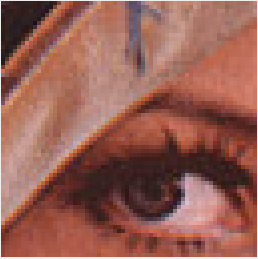

# AssemblerRAWImages
##Trabalho 3 de Organizacão e Arquitetura de Computadores

  
   
  <t>Imagem <b>"image.raw"</b> utilizada para demonstração do funcionamento do trabalho.</t>
   

O trabalho consiste no desenvolvimento de algumas funções para manipulação de imagens **.RAW**. As operações a serem
implementadas são:
  - Leitura de um arquivo binário com uma descrição de uma figura colorida, no formato RGB utilizado pelo *MARS*;
  - Exibição da figura no mostrador gráfico do MIPS;
  - Leitura e escrita de pixels da imagem;
  - Conversão para cinza.
  
Estas operações deverão ser disponibilizadas a partir de uma interface textual com o usuário. O arquivo contendo a imagem deve chamar-se **“image.raw”**.

##Instruções
  - Executar o *MARS* no mesmo diretório em que o arquivo **"image.raw"** se encontra;
  - Configuração da memória:
    - *default*
  - Ao abrir o *MARS*, após abrir o arquivo **Trabalho3.asm**, deve-se abrir o **Bitmap Display**, localizado na aba *Tools*;
  - Configuração do *Bitmap Display*:
    - Unidade de largura em *pixels*: 4
    - Unidade de altura em *pixels*: 4
    - Largura do *display*: 256
    - Altura do *display*: 256
    - Endereço base do *display*: 0x10040000 (**heap**) 
